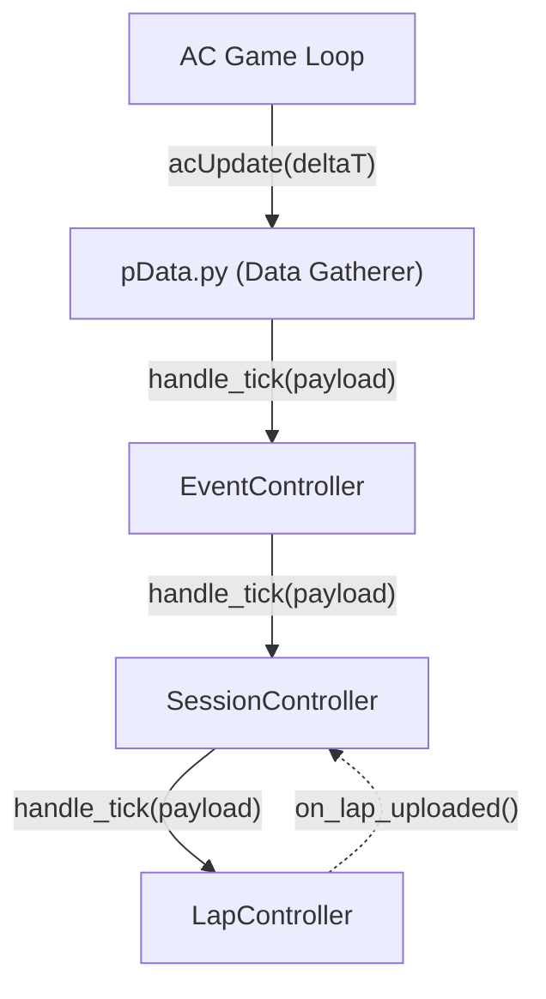
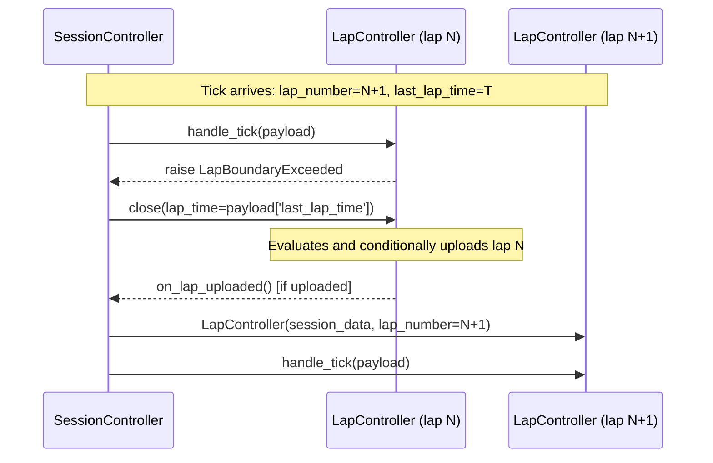
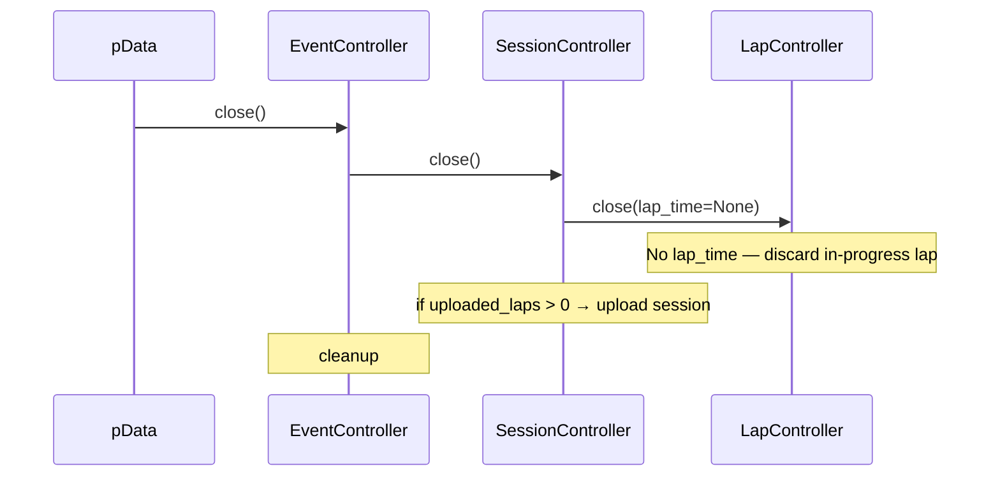

# pData Controller Architecture

## Overview

The app is structured as a pipeline of layered controllers, each responsible for a single level of the race hierarchy: event → session → lap.

`pData.py` acts as a pure data-gatherer. Each frame it reads all relevant values from the AC API and shared memory, packages them into a tick payload, and passes it to the top of the controller hierarchy. All logic lives in the controllers.

Data flows down through the hierarchy on every tick. The only upward communication is a lightweight signal from `LapController` to `SessionController` after a successful lap upload.

---

## The Tick Payload

Every tick, `pData.py` assembles a flat dict containing all relevant AC values for that frame. This dict is passed unchanged through the controller hierarchy — each layer reads what it needs and forwards the rest.

### Context fields

These describe the current state of the race session. They change infrequently but are always present.

| Field | Source | Notes |
|---|---|---|
| `session_type` | `info.graphics.session` | PRACTICE / QUALIFY / RACE / HOTLAP |
| `lap_number` | `ac.getCarState(0, acsys.CS.LapCount) + 1` | Current lap number |
| `last_lap_time` | `ac.getCarState(0, acsys.CS.LastLap)` | Completed lap time in ms; persists until next lap closes |
| `track_meter` | `floor(NormalizedSplinePosition * track_length)` | Current position on track in whole metres |
| `is_pit` | `ac.isCarInPitlane(0)` | Whether the car is in the pitlane |
| `tyres_out` | `info.physics.numberOfTyresOut` | Number of tyres off-track |

### Telemetry fields

These are per-frame values that are stored once per metre by `LapController`.

| Field | Source |
|---|---|
| `lap_time` | `acsys.CS.LapTime` |
| `speed` | `acsys.CS.SpeedKMH` |
| `gas` | `acsys.CS.Gas` |
| `brake` | `acsys.CS.Brake` |
| `gear` | `acsys.CS.Gear` |
| `steer` | `acsys.CS.Steer` |
| `rpm` | `acsys.CS.RPM` |
| `pos_x`, `pos_y`, `pos_z` | `acsys.CS.WorldPosition` |
| `ers` | `info.physics.kersCurrentKJ` |

---

## The Boundary Pattern

The most important design principle in this architecture: **the first tick of a new item carries the closing data for the previous item.**

When a lap ends, `lap_number` increments. The first tick with `lap_number = N+1` also carries `last_lap_time` — the completed time for lap N, which AC persists from the moment the lap closes. The same principle applies at the session layer.

Each controller detects a boundary by comparing the relevant context field against its own tracked value. On mismatch it raises a `BoundaryExceeded` exception. The parent controller catches this, extracts the closing data from the same payload, closes the child, creates a new child, and retries the same tick on it.

The same sequence applies one layer up, with `EventController` as parent and `SessionController` as child. On a session boundary, `EventController` closes the old `SessionController` and creates a new one; no additional closing data from the payload is required beyond detecting the `session_type` change, as the session holds its own timestamps.

---

## Controller Responsibilities

### pData.py

- Initialises the controller hierarchy in `acMain`
- Reads all AC values each frame in `acUpdate`, packages them into the tick payload, calls `event_controller.handle_tick(payload)`
- Owns per-metre sampling logic: midpoint-nearest sample selection, duplicate suppression
- Calls `event_controller.close()` in `acShutdown`

### EventController

- Holds a reference to the current `SessionController`
- Detects session boundaries (`session_type` mismatch) by catching `SessionBoundaryExceeded`
- On boundary: closes old `SessionController`, creates a new one with the updated session type, retries the tick
- On `close()`: closes the current `SessionController` with no closing data

### SessionController

- Constructed with a snapshot of event-level data: `driver`, `car`, `track`, `session_type`, session timestamp
- Holds a reference to the current `LapController`; passes the session data snapshot to it at construction so each lap upload is self-contained
- Detects lap boundaries (`lap_number` mismatch) by catching `LapBoundaryExceeded`
- On boundary: closes old `LapController` with `last_lap_time` from the payload, creates a new `LapController`, retries the tick
- Tracks a count of successfully uploaded laps, incremented via the `on_lap_uploaded()` callback from `LapController`
- On `close()`: if uploaded lap count > 0, triggers session upload (networking is a black box); otherwise discards

### LapController

- Constructed with: session data snapshot (for standalone upload), lap number, and an `on_lap_uploaded` callback
- Accumulates per-metre telemetry data, indexed by `track_meter` (one sample per metre)
- Tracks `is_invalid` (latched true when `tyres_out > 2` on any tick) and `is_pit` (latched true when `is_pit` on any tick)
- Detects lap boundary (`lap_number` mismatch) — raises `LapBoundaryExceeded`
- On `close(lap_time)`:
  - If `lap_time` is None: discard (no completed time available)
  - Apply lap filtering rules (see below)
  - If lap passes: upload with session data snapshot (black box); call `on_lap_uploaded()`
  - Otherwise: discard silently

---

## Lap Filtering Rules

Applied inside `LapController.close()`. These determine whether a completed lap is uploaded.

| Session type | `is_invalid` | `is_pit` | Action |
|---|---|---|---|
| Any | — | — | `lap_time` is None → **Discard** |
| Non-race | `True` | — | **Discard** |
| Non-race | — | `True` | **Discard** |
| Race | `True` | — | **Discard** |
| Race | `False` | `True` | **Upload** |
| Any | `False` | `False` | **Upload** |

---

## Shutdown Cascade

When `acShutdown` is called, `pData.py` calls `event_controller.close()`. This cascades down the hierarchy. Because no boundary tick arrives at shutdown, `close()` is called without closing data at every layer — any in-progress lap is discarded. The session uploads only if it has previously recorded uploaded laps.

---

## Future: EventController Layer

The `EventController` is designed to be the eventual home for bundling multiple sessions together into an "event" (e.g. a full race weekend). This layer is intentionally thin for now. When the event upload is introduced, `SessionController` will gain an `on_session_uploaded()` callback analogous to `LapController`'s `on_lap_uploaded()`, and `EventController` will apply its own upload/discard logic on close.

The boundary pattern at this layer will work identically — no structural changes to `SessionController` or `LapController` will be required.
